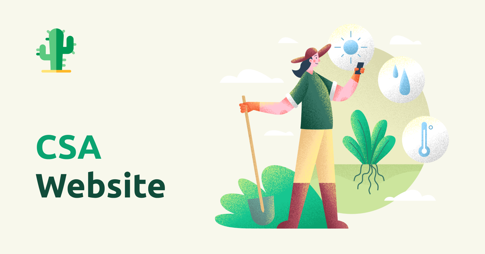

<h1 align="center">
    
</h1>

<h4 align="center"> 
	♻️ CSA - Comunidade que Sustenta a Agricultura ♻️
</h4>

 <a href="#-sobre-o-projeto">Sobre</a> •
 <a href="#-layout">Layout</a> • 
 <a href="#-tecnologias">Tecnologias</a> • 
 <a href="#-autor">Autor</a>

## 💻 Sobre o projeto

A iniciativa busca criar um ambiente Web dedicado à CSA Cajazeiras, com o objetivo de ampliar a divulgação desse movimento para um maior número de pessoas. Através dessa plataforma online, será possível compartilhar mais informações sobre a CSA de forma organizada, seus princípios, benefícios e como se envolver.

---

## 🎨 Layout

O layout está em desenvolvimento.

Em breve...

---

## 🛠 Tecnologias

As seguintes ferramentas foram usadas na construção do projeto:

#### **Website**
- Html
- Css
- Javascript

#### **Server**
- Deploy utilizando firebase

#### **Utilitários**

-   Protótipo:  **[Figma](https://www.figma.com/)**  →  **[Protótipo | CSA](https://www.figma.com/file/7aVlgksCU5xUTFW8ZIFoLb/CSA-%7C-Prototype?type=design&node-id=0%3A1&t=KNSGOO2CwvTi1Cjr-1)**
-   Editor:  **[Visual Studio Code](https://code.visualstudio.com/)**
---

## 🦸 Autor

 
  
 <b>Carlos Lopes</b>

 

 

